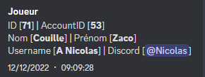

# Les Log

Les lots sont composés de différentes parties voilà un exemple que nous allons approfondir et analyser.

:::info Voila Notre Exemple : 

:::

import Tabs from '@theme/Tabs';
import TabItem from '@theme/TabItem';

<Tabs className="unique-tabs">
  <TabItem value="L'identifiant In Game ">L'identifiant ingame et l'identifiant que vous verrez sur le discriminateur et celui avec quoi vous pourrez interagir avec le joueur. Si vous voulez vous tp, bring ou jail vous devrez prendre cette identifiant (dans notre cas c'est le 71). Il est noté ID. </TabItem>
  <TabItem value="L'identifiant du compte ">Identifiant de compte ou account ID mais pas nécessaire pour vous, il est utile pour plus haut ^^ </TabItem>
  <TabItem value="Nom et prénom RP ">Le nom et prénom RP qui est visible sur le discriminateur et simplement comment s'appelle le joueur dans notre cas le joueur s'appelle Zaco Couille. </TabItem>
  <TabItem value="Nom Steam CFX ">le nom Steam ou CFX et le nom que le joueur peut se donner. Il sera visible notamment quand 2 utilisateurs veulent réaliser une emote nécessitant une validation. Cela n'est pas utile dans votre modération quotidienne ! Dans cette situation le nom est A Nicolas </TabItem>
  <TabItem value="Discord ">Vous allez voir ici son discord, cela permet de rechercher dans le log un utilisateur qui allié son compte discord sans que nous ayons son ID. parfois L’ID cdiscount peut apparaître sous cette forme &#60;@756834469087805440> </TabItem>
</Tabs>

## Mort 
Le channel *mort* permet aux staffs de pouvoir voir les personnes tuer ainsi que leur tueur, nous pouvons également voir a quelle heure elle a été tué et comment. IG, nous avons aussi ce log qui apparait au dessu de ce discriminateur. 

## Activité Staff
Le channel *activité-staff* est tout simplement les logs de prise de service des staff (Prise de personnage staff). Il est destiné au GS

## Connexion / Déconnexion 
Le channel *connexion-deconnexion* permet de voir une personne qui se connecte ou deconnecte au serveur, l'heure de connexion est précise.

:::note Info Alt F4
Lorsqu'une personne décide de déconnecter volontairement il y a dans les logs exiting quitting ou disconnected lorsque d'autres motifs apparaissent c'est que la personne a crach, donc une déconnexion du serveur non volontaire  
::: 

## Bannisement 
Le channel *bannissement* permet de voir les bannissements effectuer, avec la durer et la raison.

## Avertissement
Le channel *avertissement* permet de voir les avertissements appliquer aux joueurs avec la raison.

## Kick
Le channel *kick* permet de voir les joueurs qui ont été exclus du serveur avec le motif.

## Isolation 
Le channel *isolation* permet de voir les joueurs mis en jail avec la raison et le temps.

## Report 
Le channel *report* permet de voir les créations de report créer par un joueurs, puis permet de voir les staff rejoignant un report.

## Annonce 
Non disponible 
## Braquage 
Non disponible 
## Commands
Le channel *commands* permet de voir les personnes utilisant des commandes via au texte *T*

## Banque
Le channel *banque* permet de voir les joueurs deposant ou retirant des sous a leur banque.

## Joueurs donne / jette / recupere item

### Joueurs donne item
Le channel joueurs donne des item permet tout simplement de voir une personne donnant un item a une autre personne.
### Joueurs jetter au sol item
Le channel *joueurs-jetter-au-sol-item* permet tout simplement de voir une personne jéttant via l'inventaire une item au sol.
### Joueurs recupere au sol item
Le channel *joueurs-recupere-au-sol-item* permet tout simplement de voir une personne récuperant un item jetter au sol par un joueur.

## Stockage / voiture / appartement

### Stockage

Le channel *stockage* permet de voir les depots ainsi que les retraits des coffres d'entreprises et d'organisations.

### Stockage voiture

Le channel *stockage-voiture* permet de voir les depots ainsin que les retraits des coffres des véhicules des joueurs.
### Stockage appartement
Le channel *stockage-appartement* permet de voir les depots ainsi que les retraits des coffres des appartemant des joueurs.

## Changement entreprise organisation

Le channel *changement-entreprise-organisation* permet de voir un joueur entrant dans une organisation ou d'une entreprise.

